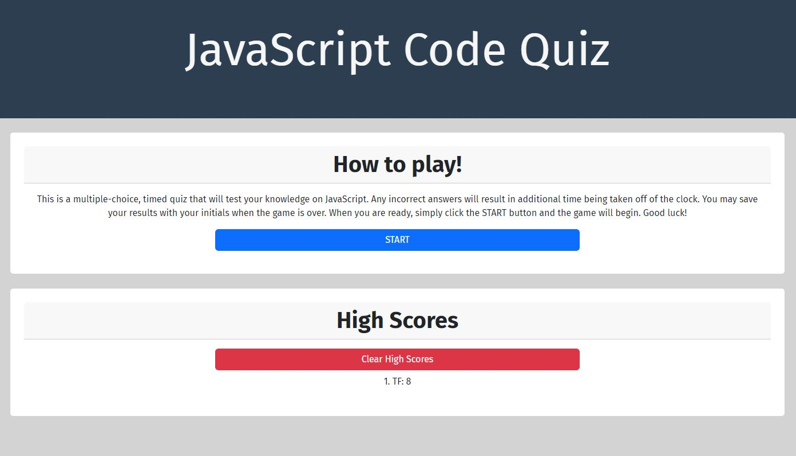

# JavaScript Code Quiz

## Project Description

The Module 4 Challenge objective was to build a timed coding quiz with multiple-choice questions. This app will run in the browser, and will feature dynamically updated HTML and CSS powered by JavaScript code. It will have a clean, polished, and responsive user interface.

## Deployment Screenshot

[Deployment Link](https://travisfowlston.github.io/Code-Quiz/)

## Comments

- Created a beginning screen to explain the rules of the quiz.
- Added a "START" button that activates the timer when selected.
- Upon answering a question, it will generate correct or incorrect to let the player know if asnwer was was right or wrong, then move on to the next question.
- If the answer was incorrect, additional time will be taken off the clock.
- When the quiz is over, the player can save their initials and score.

## Credits

- Project was completed by Travis Fowlston.

## License

- Please refer to the LICENSE in the repository.
